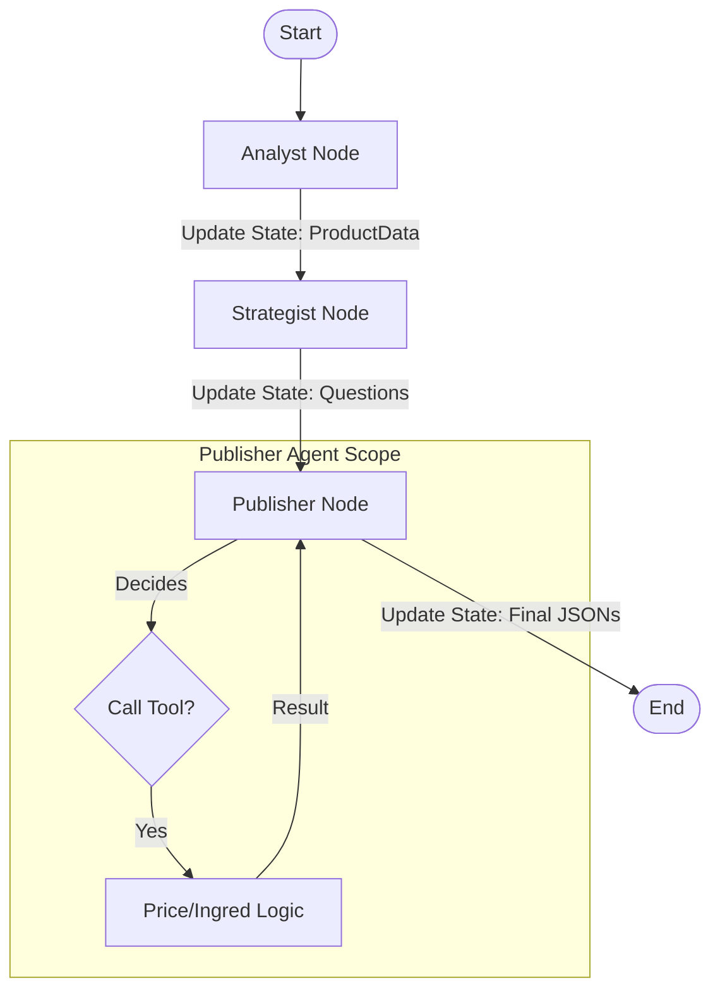

# Project Documentation

## 1. Problem Statement
The objective was to design a modular agentic system capable of ingesting raw product data and autonomously generating structured content pages (FAQ, Product Description, Comparison).

**Key Constraints:**
* **Framework Requirement:** The system must utilize an established Agentic Framework (LangChain/LangGraph) rather than custom scripts (as was my previous submission's mistake).
* **Data Constancy:** We have to operate strictly on the provided dataset without external research.
* **Structured Output:** Deliver machine-readable JSON files.

## 2. Solution Overview
To satisfy the requirement for a robust agentic architecture, I implemented the solution using **LangGraph**.

Instead of a linear script, the system is designed as a StateGraph. A shared state object (`AgentState`) flows through a graph of specialized nodes. This allows for centralized state management and standardized interface boundaries between agents.

The pipeline consists of three graph nodes:
1.  **Analyst Node:** Responsible for Extraction & Schema. It converts unstructured text into a validated Pydantic object.
2.  **Strategist Node:** Responsible for Creative Ideation. It enriches the data by generating user-centric questions.
3.  **Publisher Node:** Responsible for Tool-Assisted Assembly. Unlike a passive template engine, this agent is equipped with custom tools (e.g., `calculate_price_difference`) which it actively decides to invoke to ensure logical accuracy.

## 3. Scopes & Assumptions
* **Model:** Google Gemini Flash was chosen for its speed and native function-calling capabilities, and because it is free for use (primary reason).
* **Tooling vs. Prompting:** Critical maths logic (price math, ingredient overlap) is encapsulated in functions and bound as **Tools**. I assumed that relying on the LLM for maths is a recipe for disaster, as well as slow and redundant.
* **Competitor Data:** "Product B" data is structurally given within the main entry point for the comparison logic.

## 4. System Design

### Architecture Diagram (LangGraph)

## 5. Key Logic

1. I moved away from custom agents to LangGraph to handle state management and comply with the guidelines given in the requirements of our submission.

**Reasoning**: Building a custom orchestrator is starting from scratch. LangGraph provides a standard way to define edges, nodes, and state persistence, making the system easier to extend (e.g., adding a "Reviewer" node loop later) without rewriting the core loop.
