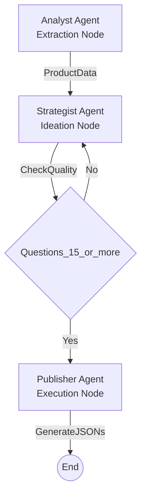

# Project Documentation

## 1. Problem Statement
The objective was to design a modular agentic system capable of ingesting raw product data and autonomously generating structured content pages (FAQ, Product Description, Comparison).

**Key Constraints:**
* **Framework Requirement:** The system must utilize an established Agentic Framework (LangChain/LangGraph) rather than custom scripts (as was my previous submission's mistake).
* **Data Constancy:** We have to operate strictly on the provided dataset without external research.
* **Structured Output:** Deliver machine-readable JSON files.

## 2. Solution Overview
To satisfy the requirement for a robust agentic architecture, I implemented the solution using **LangGraph**.

Instead of a linear script, the system is designed as a StateGraph. A shared state object (`AgentState`) flows through a graph of specialized nodes. This allows for centralized state management and standardized interface boundaries between agents.

The pipeline consists of three graph nodes:
1.  **Analyst Node:** Responsible for Extraction & Schema. It converts unstructured text into a validated Pydantic object.
2.  **Strategist Node:** Responsible for Creative Ideation. It enriches the data by generating user-centric questions.
3.  **Publisher Node:** Responsible for Tool-Assisted Assembly. Unlike a passive template engine, this agent is equipped with custom tools (e.g., `calculate_price_difference`) which it actively decides to invoke to ensure logical accuracy.

### The Workflow (State Machine)
The following diagram illustrates the system's control flow, including the **Self-Correction Feedback Loop**:

## 3. Scopes & Assumptions
* **Model:** Google Gemini Flash was chosen for its speed and native function-calling capabilities, and because it is free for use (primary reason).
* **Tooling vs. Prompting:** Critical maths logic (price math, ingredient overlap) is encapsulated in functions. I assumed that relying on the LLM for maths is a recipe for disaster, as well as slow and redundant.
* **Competitor Data:** "Product B" data is structurally given within the main entry point for the comparison logic.

## 4. Key Logic & Architectural Decisions

1. **I moved away from custom agents to LangGraph to handle state management and comply with the assignment guidelines.**
   **Reasoning**: Building a custom orchestrator is "reinventing the wheel." LangGraph provides a standardized framework for defining state persistence, cyclic graphs, and conditional routing, making the system easier to extend (e.g., adding a "Reviewer" loop) without rewriting the core execution logic.

2. **I replaced LLM-based calculations with deterministic Python tools for price analysis.**
   **Reasoning**: Large Language Models are probabilistic and prone to "hallucinating" arithmetic. By offloading math to pure Python functions (`calculate_price_difference`), I ensure 100% numerical accuracy while letting the LLM focus on what it does best: generating persuasive natural language descriptions.

3. **I implemented a "Self-Correction" feedback loop for the Strategist Agent.**
   **Reasoning**: A simple linear chain accepts the first draft regardless of quality. By utilizing LangGraph's **Conditional Edges**, the system validates the output (e.g., checking if question count < 15) and automatically forces the agent to retry with a stronger prompt if quality standards are not met.

4. **I refactored the pipeline to generate three distinct, modular JSON artifacts instead of a single monolithic file.**
   **Reasoning**: Professional frontends often load data asynchronously (e.g., loading FAQs separately from the Price Comparison). Decoupling the outputs into `faq.json`, `product_page.json`, and `comparison_page.json` adheres to the "Separation of Concerns" principle and allows for cleaner integration.

5. **I upgraded the Analyst Agent to dynamically extract competitor pricing.**
   **Reasoning**: Relying on hardcoded or "stubbed" values creates technical debt. I updated the schema to dynamically identify and extract competitor price points from unstructured text, ensuring the comparison logic adapts in real-time to the specific input provided.
