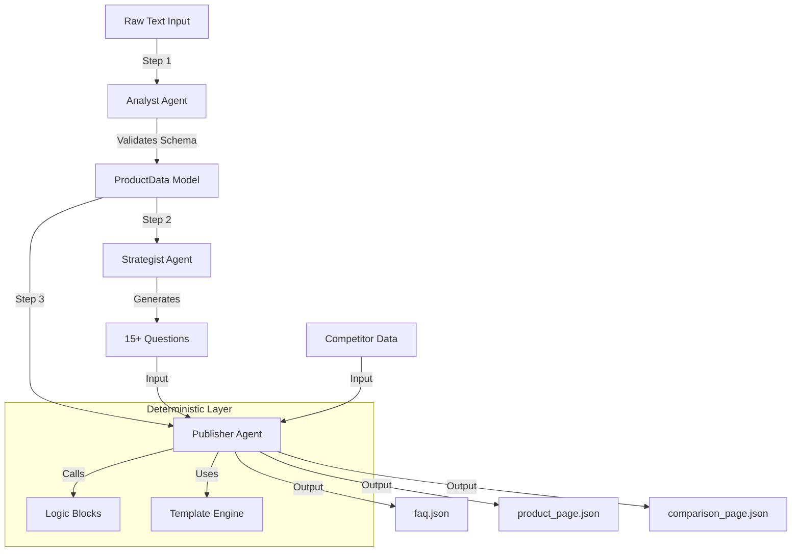

# Project Documentation

## 1. Problem Statement
The challenge was to build a modular agentic system that ingests raw product data and generates three specific types of structured content (FAQ, Product Page, Comparison) without human intervention.

Key constraints included:
* **No monolithic scripts:** The system must use distinct agents.
* **Data integrity:** Operate strictly on provided data without external research.
* **Structured Output:** All final deliverables must be machine-readable JSON.

## 2. Solution Overview
I designed a **Sequential Orchestration Pipeline** rather than a complex multi-turn conversation loop (as was requried). This ensures predictability and ease of debugging.

The system is composed of three specialized agents:
1.  **Analyst:** Focuses on data parsing and validation.
2.  **Strategist:** Focuses on creative generation (questions).
3.  **Publisher:** Focuses on deterministic assembly using logic blocks.

This separation of concerns ensures that creative/generative tasks are handled by the LLM, while the logical tasks (like price math) are handled by Python code.

## 3. Scopes & Assumptions
* **Scope - Logic vs. Generation:** I assumed that any numerical comparison (Price A vs Price B) should not be left to the LLM to avoid hallucination. These I then hardcoded as reusable logic blocks.
* **Scope - Competitor Data:** As per the requirements, "Product B" data is mocked structurally within the code to demonstrate the comparison logic.
* **Model:** Used Google Gemini Flash latest for high speed and reliable JSON schema adherence.

## 4. System Design

### Architecture
The system follows a linear DAG as was required by the documentation given:
`Ingestion -> Transformation -> Generation -> Assembly`

### Design Decisions

**1. Pydantic as the Data Contract**
Instead of passing dictionaries or raw strings between agents, I implemented a strict `ProductData` class.
* **Why:** This catches parsing errors immediately at the Analyst stage. If the LLM misses a field, the pipeline will stop and alert, rather than pushing forward with incomplete data.

**2. Decoupling Logic from Agents**
I moved the business rules section (e.g., how to calculate price difference, how to format currency) into `src/content/blocks.py`.
* **Why:** This makes the system testable and reliable.

**3. The Publisher Pattern**
The final agent (`Publisher`) does not use an LLM.
* **Why:** Once we have the structured data and the generated questions, assembling the final JSON is a deterministic task. Using an LLM here would be slow, costly and redundant.
